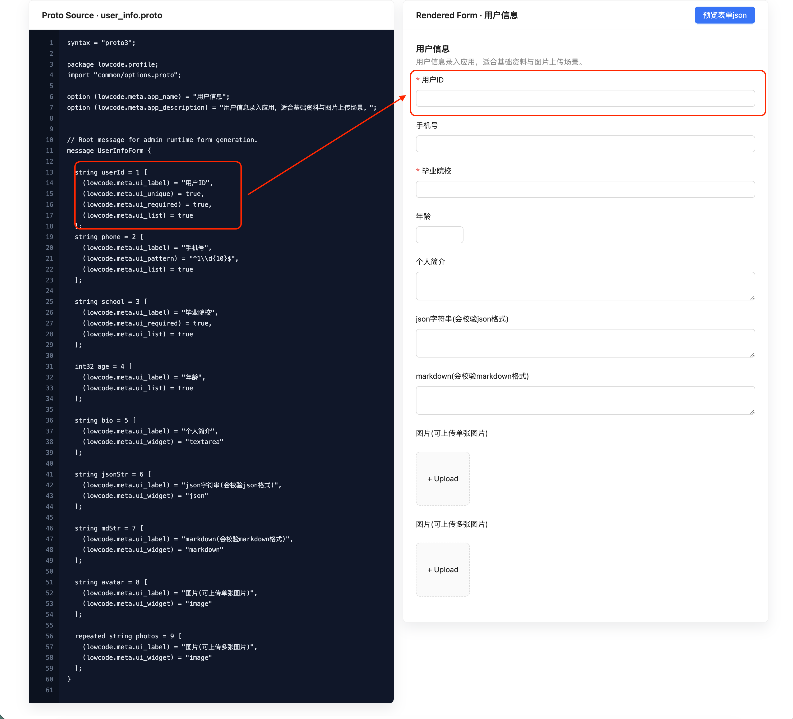
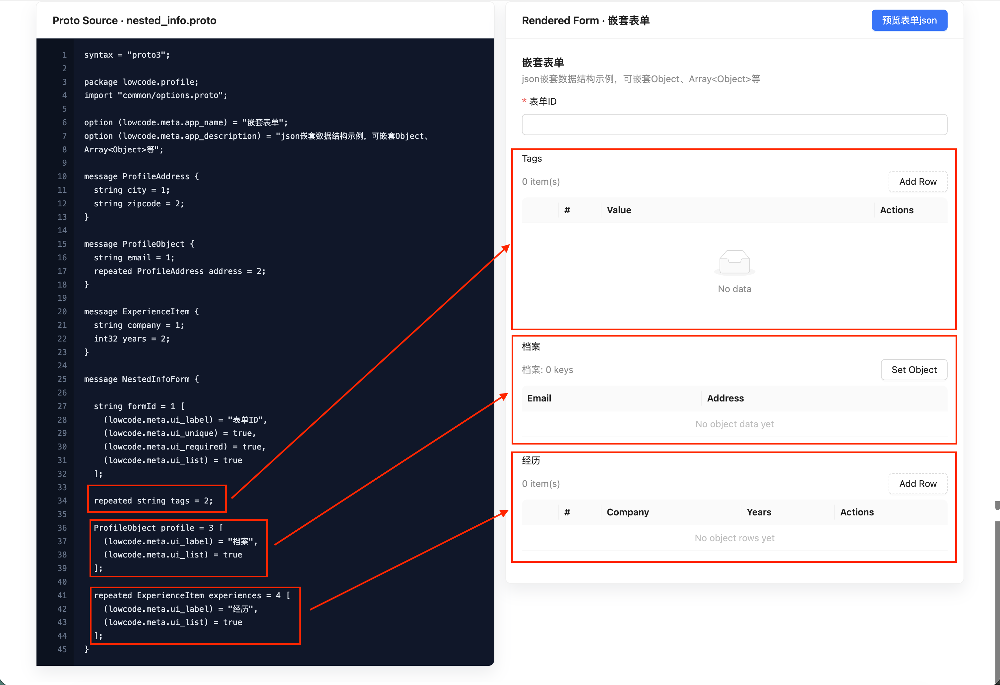

# AtlasForm Config Engine

🌐 Language

- 中文（默认）: [`README.md`](./README.md)
- English: [`README.en.md`](./README.en.md)

A Proto-driven, configuration-first low-code engine (non-drag-and-drop), designed for long-term product evolution.

> ✨ This is a **Vibe Coding** project powered by **GPT-5.3-Codex**.

AtlasForm Config Engine is a product-oriented low-code platform focused on **schema-driven form applications**.
It uses `.proto` files as the single source of truth, then generates shared types and runtime schema for:
- multi-app form modeling
- consistent frontend/backend type contracts
- runtime form rendering without manual UI rewrites

It is built for teams that want to evolve internal tools and SaaS modules over time while keeping schema changes controlled and reviewable in Git.

## 🔗 Links

- Web Demo: [https://toryangchen.github.io/atlasform-config-engine/](https://toryangchen.github.io/atlasform-config-engine/)
- Project Wiki: [https://github.com/toryangchen/atlasform-config-engine/wiki](https://github.com/toryangchen/atlasform-config-engine/wiki)

## 📸 Demo Screenshots

**Single Form**



**Nested Form**



## 🚀 Quick Start

### 1. Install

```bash
pnpm install
```

### 2. Start MongoDB (if needed)

```bash
bash infra/scripts/dev.sh
```

### 3. Start all apps

```bash
pnpm dev
```

Default ports:
- Server: `http://localhost:3000`
- Admin: `http://localhost:5174`
- Web Runtime Demo: `http://localhost:5173`

## 🧰 Common Commands

```bash
pnpm dev
pnpm dev:ui
pnpm dev:server
pnpm build
pnpm typecheck
pnpm proto:gen
```

## 📝 Notes

- `apps/web` is a runtime demo and does not persist submitted form data.
- Detailed architecture, API contracts, Proto parsing rules, and operations are maintained in the Wiki.
